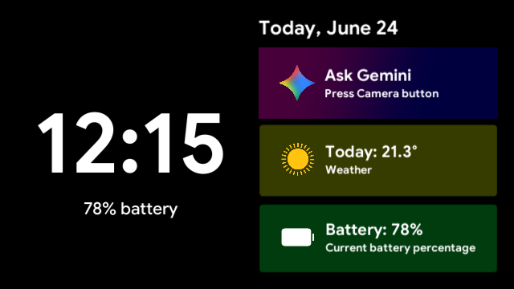
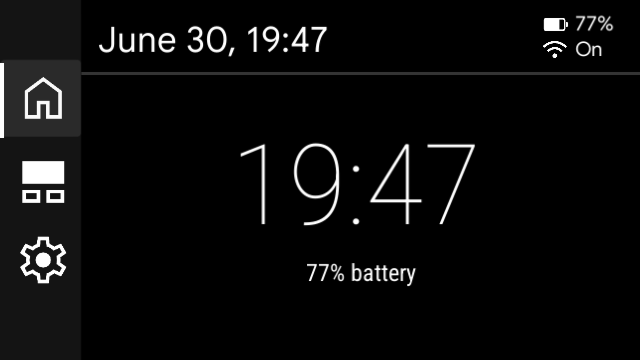
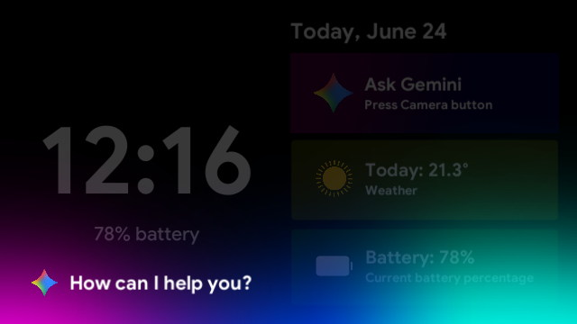
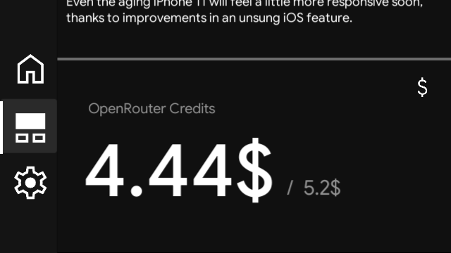
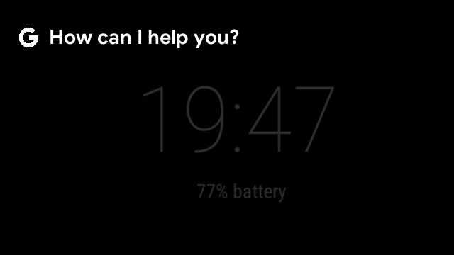

# ExplorerOS
Completely free custom ROM for Google Glass **Explorer Edition**

# Introduction

I made this custom ROM to bring Google Glass back to life after more than 13 years. It's based on the latest XE24, with some optimization tweaks from me, plus a completely new launcher.

# Features

- XE apps support (like GlassTube)
- Updated certificates
- Brand new launcher
- Gemini integration
- Improved battery life
- Modern design

# Builds

| Title | Version | Channel | Download | Info
|-------| --------|--------|---------|---------|
| ExplorerOS 26.0 Public Beta 1 | 26.0 (200626PB1) | Stable Beta | [Download](https://drive.google.com/drive/folders/1sthRXSZ63CTTSfoUvg8625V3FmW4pmbe?usp=sharing) | Very old, Install Public Beta 2 |
| ExplorerOS 26.0 Public Beta 2 | 26.0 (26PB7) | Stable Beta | [Download](https://drive.google.com/drive/folders/1sthRXSZ63CTTSfoUvg8625V3FmW4pmbe?usp=sharing) | New Design |

# Installation (currently Windows only)

#### **Before installing**: see "Post-install"

> [!WARNING]
> Make sure there are no spaces in the path to the firmware, sometimes ADB incorrectly sends folders that contain spaces

1. Download this repository
2. Download an ExplorerOS build from "Builds"
3. Install ADB & Fastboot drivers (you can use my other tool - Glassy)
4. Unpack the ExplorerOS build into the ``builds/ExplorerOS-<version>`` folder
5. Enable USB Debugging on your Glass
6. Connect your Glass to the PC and run **ExplorerFlasher.exe**

# Post-install

1. Go to [Weather API](https://www.weatherapi.com) and get your API Key (free)
2. Go to [News API](https://www.newsapi.org) and get your API Key (free)
3. Go to [Open Router](https://openrouter.ai), add $5 to your balance, and get your API Key (paid)
4. To use AI, you need a Python Flask server. If you don't want to set it up, you can use my server instead.

# Server Setup

> [!TIP]
> If you don't want to buy a server, you can use my server completely free

1. Install Python on your Linux Server
2. Run: ``pip3 install flask requests`` (if you have any errors, add ``--break-system-packages``)
3. Download ``server/server.py`` on your server and run it: ``python3 server.py``

# Support

We have a discord server! [Join ExplorerOS Discord Server](https://discord.gg/DSkWE3JjG)

# System itself

##### Home Page and Standby:

- Tap once to exit Standby Mode
- Press CAMERA Button to activate Gemini

- Switch between pages using Touchpad

#### Widgets Page:

- Tap once to show more
- Use Touchpad to scroll

##### Gemini Demo:

- Press the Camera button to close Gemini
